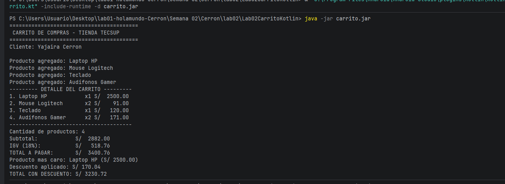

Laboratorio 02 - Carrito de compras 

Yajaira Cerron Mancilla 

Descripción
En este laboratorio desarrollé un carrito de compras utilizando Kotlin. El programa permite registrar productos con su nombre, precio y cantidad, mostrar el detalle de los productos agregados y realizar los cálculos correspondientes al subtotal, IGV y total a pagar. También se implementaron funciones para mostrar el detalle del carrito con columnas alineadas, identificar el producto más caro y calcular un descuento utilizando la estructura when.
Las principales funciones implementadas fueron:

CalcularSubtotal(): calcula la suma del precio por la cantidad de cada producto.

CalcularIGV(): calcula el 18% de IGV sobre el subtotal.

CalcularTotal(): suma el subtotal y el IGV.

MostrarDetalle(): muestra los productos del carrito con su cantidad e importe.

CalcularDescuento(): aplica un descuento dependiendo del total de la compra.

Pregunta: ¿Por qué nombre y precio son val pero cantidad es var?
 nombre y precio se declaran con val porque son valores que no deberían modificarse después de crear un producto. Por ejemplo, una vez creado un producto como una Laptop HP con un determinado nombre y precio, esos datos permanecen constantes.
En cambio, cantidad se declara con var porque puede cambiar durante el uso del carrito. Por ejemplo, un producto puede comenzar con una cantidad de 1 y posteriormente aumentar a 2 o más unidades.
 Si intentara cambiar el precio de un producto después de haberlo creado, Kotlin mostraría un error porque precio fue declarado con val y, por lo tanto, no puede reasignarse.

