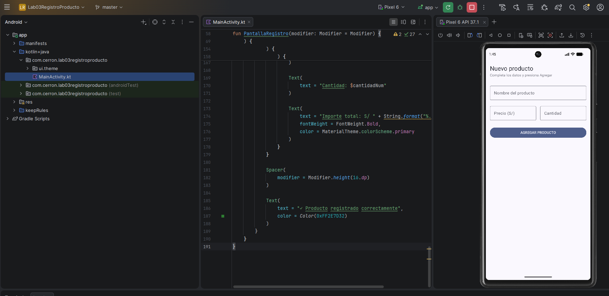
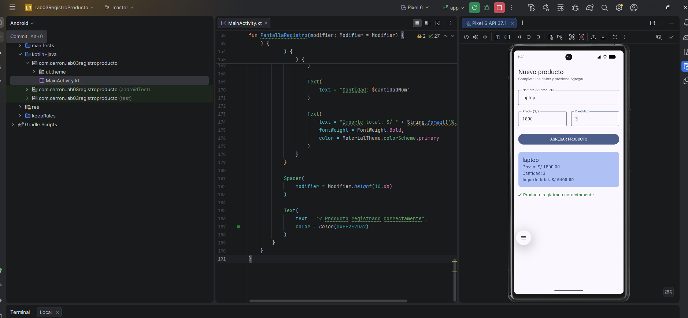

# Lab03 - Registro de Producto con Jetpack Compose

## Estudiante
Yajaira Cerrón Mancilla

## Descripción
Aplicación desarrollada con Jetpack Compose para registrar un producto ingresando nombre, precio y cantidad.

Al presionar el botón **AGREGAR PRODUCTO**, la aplicación muestra una tarjeta con el resumen del producto y calcula automáticamente el importe total multiplicando el precio por la cantidad.

## Captura 1 - Formulario vacío

## Captura 2 - Producto registrado

## ¿Qué pasaría si declaras las variables de los campos SIN remember?

Si las variables se declaran sin `remember`, Compose no conservaría correctamente los valores durante las recomposiciones.

Cuando el usuario escriba en un `TextField`, la interfaz puede volver a dibujarse. Sin `remember`, el valor podría volver a su estado inicial y el texto ingresado no se mantendría.

`remember` permite conservar el estado mientras el composable permanece en la composición.
