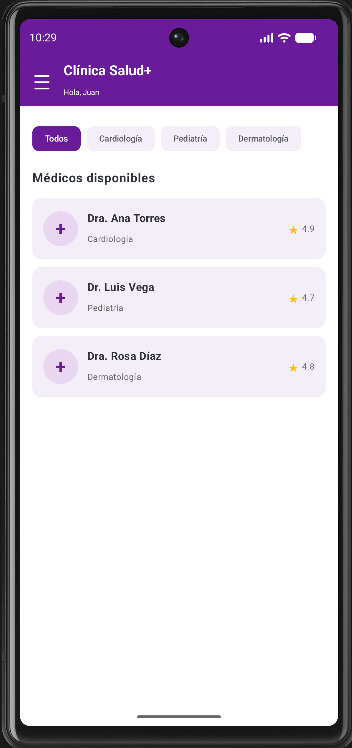
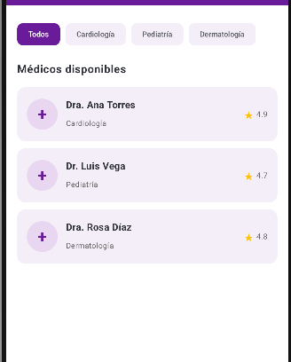
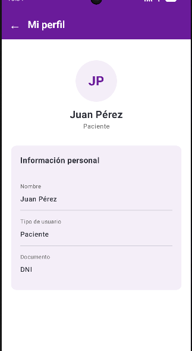
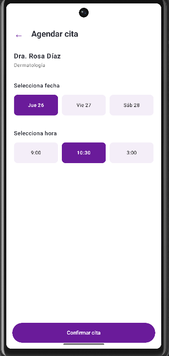
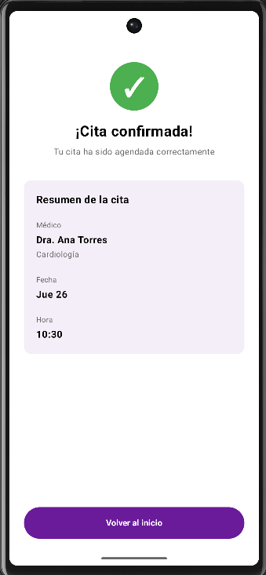
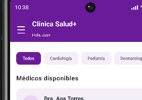
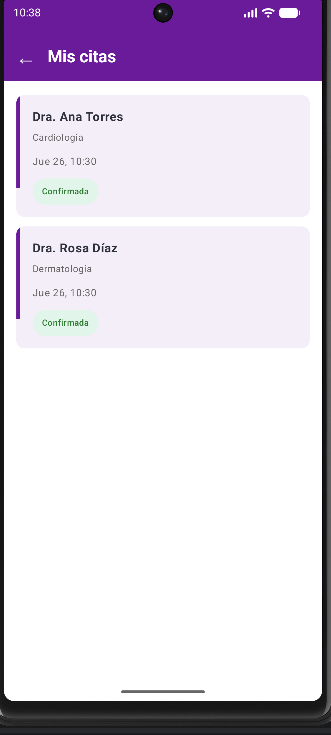

# 🏥 Clínica Salud+

Aplicación móvil desarrollada en **Kotlin con Jetpack Compose** para la gestión de citas médicas.

El proyecto permite visualizar médicos por especialidad, consultar el perfil de un médico, seleccionar una fecha y hora para una cita y visualizar la confirmación de la cita registrada.

## 👩‍💻 Datos del proyecto

- **Proyecto:** Clínica Salud+
- **Curso:** Programación de Aplicaciones Móviles
- **Tecnología:** Kotlin + Jetpack Compose
- **IDE:** Android Studio
- **Estudiante:** Yajaira Cerron

---

# 📋 Requerimientos funcionales

## RF-01 — Visualizar médicos y filtrar por especialidad

El sistema permite visualizar una lista de médicos disponibles.

Cada médico muestra información como:

- Nombre
- Especialidad
- Calificación

Además, el usuario puede filtrar los médicos mediante las especialidades disponibles.

### Evidencia





---

## RF-02 — Seleccionar médico y visualizar su perfil

El usuario puede seleccionar un médico desde la pantalla principal.

Al seleccionar un médico, el sistema navega hacia su perfil mostrando información como:

- Nombre del médico
- Especialidad
- Calificación
- Descripción
- Opción para agendar una cita

### Evidencia



---

## RF-03 — Agendar una cita

Desde el perfil del médico, el usuario puede seleccionar la opción **Agendar cita**.

El sistema permite seleccionar:

- Una fecha disponible
- Una hora disponible

La selección es única, por lo que solo puede existir una fecha y una hora seleccionadas al mismo tiempo.

### Evidencia



---

## RF-04 — Confirmar la cita

Después de seleccionar la fecha y la hora, el sistema muestra una pantalla de confirmación con el resumen de la cita.

La confirmación contiene:

- Médico seleccionado
- Especialidad
- Fecha
- Hora
- Estado de la cita

### Evidencia



---

# 🧭 Navegación de la aplicación

El flujo principal de navegación es:

```text
Inicio
   ↓
Perfil del médico
   ↓
Agendar cita
   ↓
Confirmación
   ↓
Inicio
```

Los datos del médico seleccionado se envían mediante parámetros de navegación.

La fecha y la hora seleccionadas también se envían a la pantalla de confirmación.

---

# ☰ Menú lateral

La aplicación cuenta con un menú lateral para acceder a diferentes secciones.

Las opciones implementadas son:

- Inicio
- Mis citas
- Historial médico
- Perfil

El menú también muestra información básica del paciente.

### Evidencia



---

# 📅 Mis citas

La sección **Mis citas** permite visualizar las citas registradas por el usuario.

Cada tarjeta muestra:

- Médico
- Especialidad
- Fecha
- Hora
- Estado

Los estados se diferencian visualmente para facilitar su identificación.

### Evidencia



---

# 👤 Perfil del paciente

La aplicación incluye una pantalla de perfil del paciente accesible desde el menú lateral.

En esta pantalla se muestra información básica del usuario, como su nombre y tipo de usuario.

---

# 🧩 Componentes de Jetpack Compose utilizados

Durante el desarrollo se utilizaron diferentes componentes de Jetpack Compose:

- `Scaffold`
- `TopAppBar`
- `ModalNavigationDrawer`
- `NavigationDrawerItem`
- `LazyColumn`
- `LazyRow`
- `Card`
- `Button`
- `Text`
- `Row`
- `Column`
- `Box`
- `Surface`

---

# 🔄 Manejo de estados

La aplicación utiliza estados locales de Jetpack Compose.

Entre los elementos utilizados se encuentran:

```kotlin
remember
mutableStateOf
mutableStateListOf
```

Los estados permiten actualizar automáticamente la interfaz cuando el usuario selecciona una especialidad, fecha, hora o registra una cita.

En esta fase del proyecto **no se utiliza ViewModel ni arquitectura MVVM**.

---

# 🛠️ Tecnologías utilizadas

- Kotlin
- Jetpack Compose
- Material 3
- Navigation Compose
- Android Studio
- Git
- GitHub

---

# 📱 Pantallas implementadas

1. Inicio
2. Perfil del médico
3. Agendar cita
4. Confirmación
5. Mis citas
6. Historial médico
7. Perfil del paciente

---

# 📂 Estructura principal

```text
Clinica
│
├── app
│   └── src/main/java/com/cerron/clinica
│       │
│       ├── model
│       │   ├── Cita.kt
│       │   └── Datos.kt
│       │
│       ├── navigation
│       │   ├── AppNavigation.kt
│       │   └── Screen.kt
│       │
│       ├── screens
│       │   ├── AgendarCitaScreen.kt
│       │   ├── ConfirmacionScreen.kt
│       │   ├── HistorialScreen.kt
│       │   ├── HomeScreen.kt
│       │   ├── MisCitasScreen.kt
│       │   ├── PerfilMedicoScreen.kt
│       │   └── PerfilScreen.kt
│       │
│       └── MainActivity.kt
│
├── evidencias
│   ├── inicio.png
│   ├── filtro.png
│   ├── perfil.png
│   ├── agendar.png
│   ├── confirmacion.png
│   ├── drawer.png
│   └── mis-citas.png
│
└── README.md
```

---

# ✅ Resultado

Se implementó una aplicación móvil funcional para la gestión de citas médicas utilizando **Kotlin y Jetpack Compose**.

La aplicación permite realizar el flujo:

**seleccionar médico → visualizar perfil → seleccionar fecha y hora → confirmar cita → consultar la cita registrada.**

También se implementó navegación mediante menú lateral y manejo de estados locales con Jetpack Compose.captura donde aparezca una cita registrada.